# Diagnostic Healthcare Booking & Payment Platform

A backend service for diagnostic centre discovery, test bookings, snapshot pricing, database-enforced idempotency, and resilient webhook processing. Built with Django, Django REST Framework, and PostgreSQL.

---

## Architecture & State Machine

### Booking State Machine
Bookings progress through a strict finite state machine. Illegal transitions raise `InvalidStateTransitionError` (`409 Conflict` on customer-facing APIs). Every transition appends an immutable audit entry to `BookingStatusHistory`.

```mermaid
stateDiagram-v2
    [*] --> PENDING: Booking Created (Price Snapshotted)
    PENDING --> CONFIRMED: Payment SUCCESS
    PENDING --> FAILED: Payment FAILED
    PENDING --> CANCELLED: User/Admin Cancels / Expired (No in-flight payment)
    FAILED --> PENDING: Payment Retry (POST /payments/)
    FAILED --> CONFIRMED: Late SUCCESS (Money Captured; Refund if slot rebooked)
    FAILED --> CANCELLED: User/Admin Cancels
    CONFIRMED --> CANCELLED: Cancellation (Refund Flagged)
    CONFIRMED --> CONFIRMED: Late FAILED (Logged & Ignored)
    CANCELLED --> CANCELLED: Late SUCCESS (Payment Flagged for Refund)
    CANCELLED --> [*]: Terminal State
```



---

## Key Design Decisions & Tradeoffs

Detailed Architecture Decision Records are maintained in [`docs/adr/`](docs/adr/):

1. **Database-Level Idempotency over Distributed Locks ([ADR 0001](docs/adr/0001-db-constraint-idempotency.md))**:
   Deduplication is enforced directly by PostgreSQL unique constraints (`WebhookEvent.event_id` and `Payment(user, idempotency_key)`). In-memory checks (`if already_processed: return`) break under concurrent retries arriving in the same millisecond. Volatile Redis locks introduce failure modes around worker crashes and TTL expiry. The database engine provides ACID atomicity with zero extra infrastructure.

2. **Single Canonical Service Funnel & Unidirectional Payment FSM ([ADR 0002](docs/adr/0002-single-service-funnel.md))**:
   Both synchronous payment responses and asynchronous webhooks funnel through one transactional function: `apply_payment_result()`. It enforces consistent lock ordering (`Booking` locked first, then `Payment`) and a monotonic payment state machine: `SUCCESS` is terminal and cannot be overwritten by late failures, and exact duplicate deliveries execute as idempotent no-ops rather than false double-charges.

3. **Status Audit Trail ([ADR 0003](docs/adr/0003-status-audit-trail.md))**:
   Every status change writes an append-only row to `BookingStatusHistory` recording `from_status`, `to_status`, `source`, and `event_id` inside the same database transaction.

4. **Resource Enumeration Defense ([ADR 0004](docs/adr/0004-404-over-403-enumeration.md))**:
   When User B queries User A's booking ID, or a client references a non-existent booking during checkout, the API uniformly returns `404 Not Found` rather than `403 Forbidden` or `400 Bad Request`. This completely eliminates timing and status-code side channels that could reveal which booking IDs exist.

5. **Nested Savepoints for PostgreSQL IntegrityError ([ADR 0005](docs/adr/0005-nested-savepoint-integrity-error.md))**:
   Catching an `IntegrityError` in a raw PostgreSQL transaction aborts the entire transaction block. Inbound webhook deduplication uses a nested savepoint (`with transaction.atomic():`). On duplicate collision, Postgres rolls back only to the savepoint, leaving the outer transaction healthy.

6. **Premature Webhook Race & Pre-Invocation Commit ([ADR 0006](docs/adr/0006-premature-webhook-and-payment-creation-ordering.md))**:
   In `POST /payments/`, `PENDING` payments are committed in a dedicated short transaction before dispatching to the external payment gateway. If a webhook arrives before the row exists, the webhook rolls back and returns `404 Not Found`, prompting provider retries rather than silently losing the event.

7. **Snapshot Pricing & Immutability**:
   Prices reside on `CentreTest` (since different diagnostic labs charge different rates for the same test). At booking creation, `Booking.amount` copies `CentreTest.price`. Subsequent price updates by lab administrators do not alter past bookings.

8. **In-Flight Payment Constraint**:
   A conditional unique constraint `models.UniqueConstraint(fields=["booking"], condition=Q(status="PENDING"))` prevents multiple concurrent payments from being in flight for a single booking.

---

## Quickstart

### Option 1: Docker Compose (Recommended)

Starts PostgreSQL 16 and the Django application with automated migrations:

```bash
# 1. Start containers
docker compose up -d

# 2. Seed catalog, demo users, and test prices
docker compose exec web python manage.py seed_data

# 3. Run full test suite against real PostgreSQL
docker compose exec web pytest -v
```

The API is accessible at `http://localhost:8000`.
Interactive Swagger UI documentation is available at `http://localhost:8000/api/docs/`.

### Option 2: Local Environment

```bash
# 1. Setup virtual environment
python -m venv .venv
source .venv/bin/activate  # On Windows: .\.venv\Scripts\Activate.ps1

# 2. Install dependencies
pip install -r requirements-dev.txt

# 3. Setup environment and database
cp .env.example .env
python manage.py migrate
python manage.py seed_data

# 4. Run tests
pytest -v

# 5. Start dev server
python manage.py runserver 0.0.0.0:8000
```

---

## Step-by-Step cURL Verification Pipeline

Run these commands in order to test the complete user journey:

### 1. User Authentication (Obtain JWT)
```bash
curl -s -X POST http://localhost:8000/api/v1/auth/login/ \
  -H "Content-Type: application/json" \
  -d '{"username": "demouser", "password": "DemoPass123!"}'
```
*Export the access token:*
```bash
export TOKEN="<access_token_from_response>"
```

### 2. Discover Diagnostic Centres & Tests
```bash
# List centres in Mumbai
curl -s -X GET "http://localhost:8000/api/v1/catalog/centres/?city=Mumbai" \
  -H "Authorization: Bearer $TOKEN"

# List available centre tests with pricing
curl -s -X GET http://localhost:8000/api/v1/catalog/centre-tests/ \
  -H "Authorization: Bearer $TOKEN"
```

### 3. Create a Booking (Price Snapshotted)
```bash
curl -s -X POST http://localhost:8000/api/v1/bookings/ \
  -H "Authorization: Bearer $TOKEN" \
  -H "Content-Type: application/json" \
  -d '{
    "centre_test": 1,
    "appointment_at": "2026-10-15T09:00:00Z"
  }'
```
*Note the returned `id` (e.g. `1`).*

### 4. Initiate Payment with Idempotency Key
```bash
curl -s -X POST http://localhost:8000/api/v1/payments/ \
  -H "Authorization: Bearer $TOKEN" \
  -H "Content-Type: application/json" \
  -H "Idempotency-Key: client-req-unique-key-001" \
  -d '{
    "booking": 1,
    "simulate_outcome": "SUCCESS"
  }'
```

### 5. Replay Same Payment (Idempotency Verification)
```bash
# Repeating the exact request returns the original cached response with zero duplicate charge:
curl -s -X POST http://localhost:8000/api/v1/payments/ \
  -H "Authorization: Bearer $TOKEN" \
  -H "Content-Type: application/json" \
  -H "Idempotency-Key: client-req-unique-key-001" \
  -d '{
    "booking": 1,
    "simulate_outcome": "SUCCESS"
  }'
```

### 6. Deliver HMAC-Signed Webhook
```bash
# Payload
PAYLOAD='{"event_id": "wh_evt_8899", "provider_ref": "<provider_ref_from_step_4>", "status": "SUCCESS", "amount": "450.00"}'

# Compute HMAC-SHA256 signature with shared secret
SIGNATURE=$(echo -n "$PAYLOAD" | openssl dgst -sha256 -hmac "eve_test_webhook_secret_shared_key_2026" | awk '{print $2}')

# Deliver webhook
curl -s -X POST http://localhost:8000/api/v1/payments/webhook/ \
  -H "Content-Type: application/json" \
  -H "X-Webhook-Signature: sha256=$SIGNATURE" \
  -d "$PAYLOAD"
```

### 7. Replay Webhook (Replay Deduplication)
```bash
# Delivering the same event_id returns 200 OK with {"status": "duplicate"}:
curl -s -X POST http://localhost:8000/api/v1/payments/webhook/ \
  -H "Content-Type: application/json" \
  -H "X-Webhook-Signature: sha256=$SIGNATURE" \
  -d "$PAYLOAD"
```

---

## Operational Commands

### Expire Stale PENDING Bookings
Cancels bookings left in `PENDING` status for more than 15 minutes. Uses `select_for_update(skip_locked=True)` so it never blocks concurrent checkouts, and automatically skips bookings with an active in-flight payment.
```bash
# Docker:
docker compose exec web python manage.py expire_stale_bookings --minutes 15

# Local:
python manage.py expire_stale_bookings --minutes 15
```

### Payment Reconciliation Job
Finds payments stuck in `PENDING`, queries the provider ledger for ground truth, and settles them through `apply_payment_result()`.
```bash
# Docker:
docker compose exec web python manage.py reconcile_payments --minutes 15

# Local:
python manage.py reconcile_payments --minutes 15
```

### Chaos Simulator & Invariant Verification
Dispatches dozens of bookings and subjects the webhook ingestion pipeline to simulated provider chaos (duplicate deliveries, random delays, out-of-order events, and dropped webhooks). Automatically triggers reconciliation and asserts distributed invariants.
```bash
# Docker:
docker compose exec web python scripts/chaos_simulator.py http://localhost:8000 50

# Local:
python scripts/chaos_simulator.py http://127.0.0.1:8000 50
```

Verified Invariant Report Output:
```text
======================================================================
INVARIANT VERIFICATION REPORT
======================================================================
  * Total Bookings Evaluated:       50
  * Injected Duplicate Webhooks:     29
  * Injected Dropped Webhooks:       12
  * Settled only by reconciliation:  12
  * Payment != provider ledger:      0 (MUST BE 0)
  * Booking != payment outcome:      0 (MUST BE 0)
  * Wrong refund flags:              0 (MUST BE 0)
  * Still PENDING after reconcile:   0 (MUST BE 0)
----------------------------------------------------------------------
All invariants held for this run.
======================================================================
```

---

## Testing Matrix

| Test Suite | File | Focus |
|---|---|---|
| **Authentication** | `tests/test_auth.py` | Registration validation, weak password rejection, duplicate checks, JWT lifecycles |
| **Catalog & RBAC** | `tests/test_catalog.py` | Admin permissions vs 403 non-admin, pricing uniqueness `(centre, test)` |
| **Bookings & FSM** | `tests/test_bookings.py` | Price snapshotting, past date rejection, 404 security isolation, audit history |
| **Payments** | `tests/test_payments.py` | Scoped idempotency key, 422 mismatch, 409 conflict, double-charge refund flag |
| **Webhooks** | `tests/test_webhooks.py` | HMAC verification, savepoint replay safety, slot collision recovery, multithreaded concurrency |
| **Edge Cases** | `tests/test_edge_cases.py` | Payment state machine monotonicity, cancel read locking, unforgeable 404s, stale provider drops |
| **Property-Based** | `tests/test_hypothesis.py` | Hypothesis testing across randomized event arrival streams asserting invariants |
| **Health & Tracing** | `tests/test_healthz.py` | `/healthz` DB verification, contextvars `X-Request-ID` propagation |

Execute all tests:
```bash
pytest -v --tb=short
```

---

## Data Privacy & Compliance Note
In accordance with healthcare data protection principles and India's **Digital Personal Data Protection (DPDP) Act 2023**, patient health information (PHI) is strictly compartmentalized. Application log formatters record only correlation IDs (`request_id`, `booking_id`, `event_id`, `provider_ref`) and never log patient diagnostic results or personally identifiable medical details.

---

## With More Time / Future Improvements
- **Automated Refund Gateway**: Integrate direct refund dispatch via gateway refund APIs when `flagged_for_refund=True`.
- **Slot Capacity Management**: Atomic conditional slot increments using `Slot.objects.filter(id=..., booked__lt=F('capacity')).update(booked=F('booked')+1)` to prevent physical overbooking at physical labs.
- **Transactional Outbox Pattern**: Emit patient notifications (SMS/Email) via an append-only `OutboxEvent` table processed by asynchronous Celery workers to avoid dual-write hazards.
